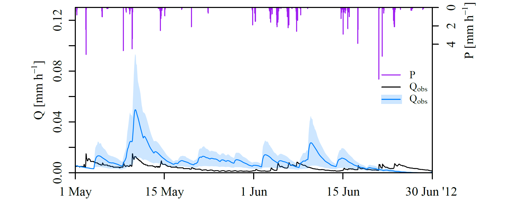

Module 7: Matrix operations
---

***Compute statistics for multiple modelled discharge time series***

In this assignment you will reproduce the figure below, which shows the range of simulated discharges when a model (WALRUS) is run with different parameter sets.

1. Download `Qmod_parameters.dat` and `output_WALRUS.dat`. The first file contains a matrix with time steps in rows and different model runs in columns, from the period 1 May-30 June 2012. The second contains input and output of one of the model runs as well as observed precipitation ($P$) and discharge ($Q_\mathsf{obs}$) of the whole of 2012.
2. Initialize the script with standard headers and working directory.
3. Read the data files. Make a small data frame with only the period 1 May-30 June 2012 from the `output_WALRUS.dat` file.
4. Compute the mean discharge for each time step (averaged over all runs). Don't use a for-loop, but look for a standard function in the reference list of *A (very) short introduction to R*. Give the resulting vector a logical name. 
5. Compute the 10th and 90th percentile for each time step, resulting in two vectors. You need two standard functions to do this: one for the percentiles and one called `apply`.
6. Plot the observed discharge as a black line and add the mean modelled discharge as a blue line. You don't need $x$-values, because the data points are equidistant.
7. Plot the light blue range:
    1. Google how to get a transparent version of the shade of blue you chose.
    2. Combine the 10th and 90th percentile in one vector, where you reverse the order of the 90th percentiles (so from the last point in the time series to the first).
    3. Make two vectors: from one to the number of datapoints and the same vector backwards. Then combine the vectors into one vector, which you will use as $x$-values for the percentile range.
    4. Use the function `polygon` to plot the light blue range. Use the two vectors you created as $x$- and $y$-values. 
8. Add the rainfall data to the plot. Use `par(new=TRUE)` to plot these over the previous plot. Search which arguments you need to add to `plot` to get vertical lines and suppress plotting $x$- and $y$-axes.
9. Add $x$-axis and $y$-axis on the right separately. Also add axis labels. 
10. Add the legend (only the lines).
11. Add a light blue rectangle behind the blue line for the modelled discharge in the legend. Google ``rectangle R'' or similar to find the command.
12. Add code above and below the figure to save it as pdf.

*Simulated discharge with different parameter sets. Figure source: C.C. Brauer, P.J.J.F. Torfs, A.J. Teuling, R. Uijlenhoet (2014b): The Wageningen Lowland Runoff Simulator (WALRUS): application to the Hupsel Brook catchment and Cabauw polder, Hydrol.  Earth Syst. Sci., 18, 4007-4028, www.hydrol-earth-syst-sci.net/18/4007/2014/hess-18-4007-2014.pdf*
